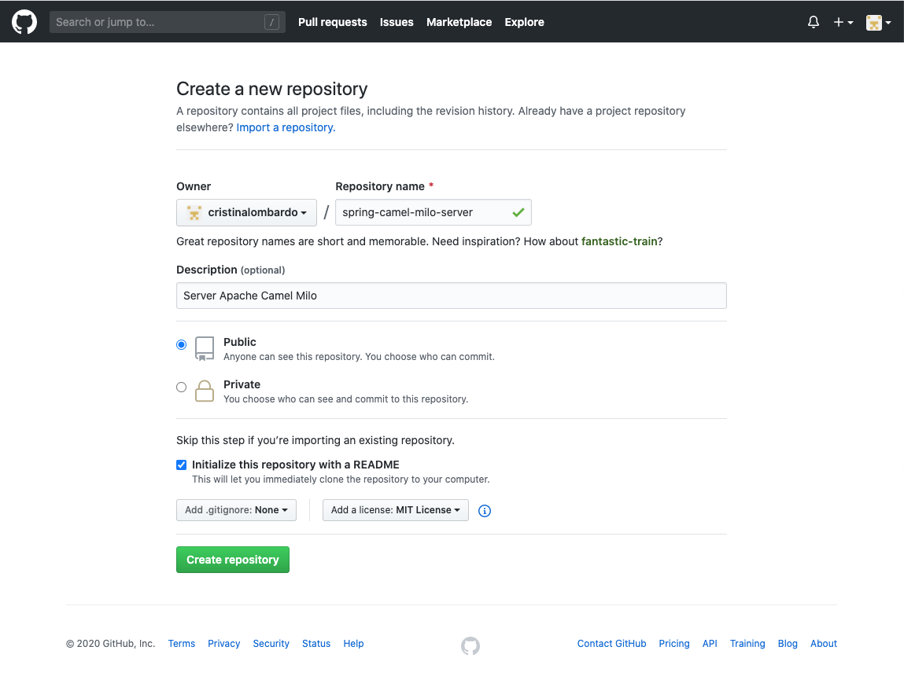
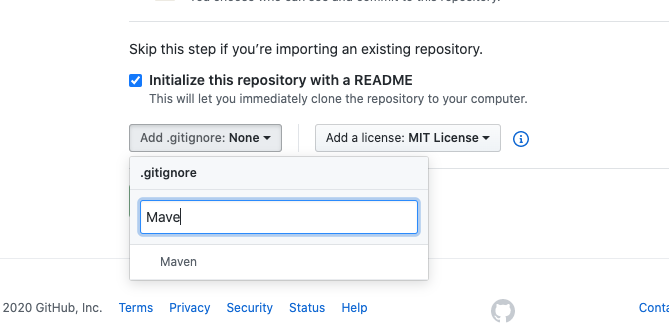

# Inizializzare il progetto su GitHub

[Back To README](/README.md)

## Table of content
1. [Step1: creare il progetto su GitHub](#step1-creare-il-progetto-su-github)
1. [Step2: Readme and .gitignore](#step2-readme-and-gitignore)
1. [Step3: Repo Download](#step3-repo-download)

## Step1: Creare il progetto su github

## Step2: Readme and .gitignore

Aggiungere Readme e .gitignore

Come template del .gitignore è stato scelto Maven.

## Step3: Repo Download
Creare il repository e clonarlo in locale con il programma preferito di gestione del git.

---
@Copiright [Cristina Lombardo](https://github.com/cristinalombardo/) / [License](/LICENSE)