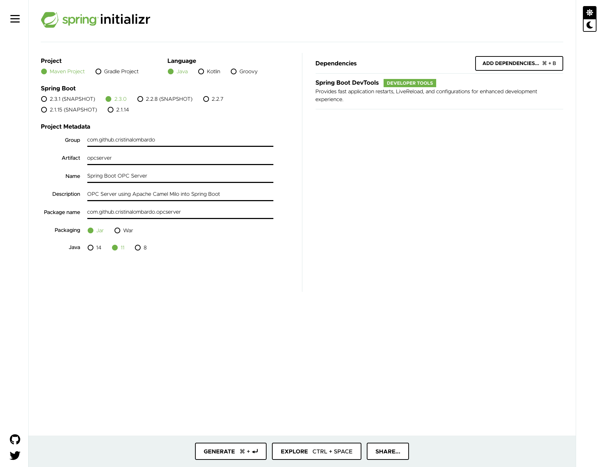
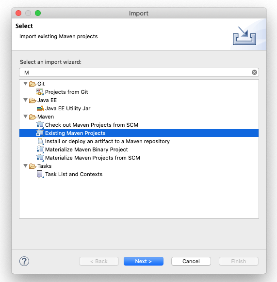

# Creazione del progetto SpringBoot

[Back To README](/README.md)

Prerequisiti: 
- Java 9+ 
- Eclipse per j2ee con Spring Tools Suite Plugin installato

## Step1: Spring Init
Per inizializzare il progetto utilizzeremo Spring Initializr 

[Go to Spring initializr](https://start.spring.io/)

Inizializzare il progetto in accordo alla seguente immagine

Per inizializzare il progetto abbiamo utilizzato le seguenti configurazioni:
- Maven: Utiliuzzeremo Maven per coimpilare il progetto
- Spring Boot 2.3.0: Versione Stable di Spring Boot al momento di questo tutorial
- Packaging Jar: Si vuole realizzare un'applicazione standalone
- Java 11: Apache Camel Milo richiede Java 9+
- Dependencies Spring Boot DevTools: dipendenza utile durante lo sviluppo

A questo punto è possibile scaricare il progetto cliccando sul tasto GENERATE.
Una volta scaricato il progetto è stato copiato nella root del repository e decompattato.

## Step2: Importare il progetto Maven dentro Eclipse

Per importare il progetto i passi sono:

1. Aprire Eclipse 
1. Cliccare su File->Import... e selezionare Existing Maven Project 

1. Selezionare la cartella dove risiede il progetto e cliccare su Finish 

---
@Copiright [Cristina Lombardo](https://github.com/cristinalombardo/) / [License](/LICENSE)