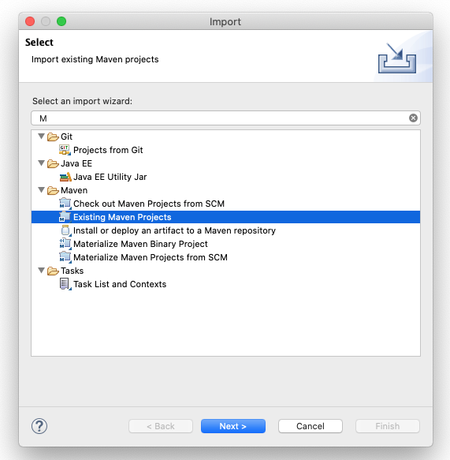

# Opc Server with Milo and Spring Boot
> Documentazione di progetto per la materia Informatica Industriale
<!-- TOC depthFrom:2 -->

- [Introduzione](#introduzione)
- [Perché Spring](#perché-spring)
- [Descrizione del progetto](#descrizione-del-progetto)
- [Funzionameto](#funzionameto)
- [Annex 1: GitHub](#annex-1-github)
    - [Step1: Creare il progetto su github](#step1-creare-il-progetto-su-github)
    - [Step2: Readme and .gitignore](#step2-readme-and-gitignore)
    - [Step3: Repo Download](#step3-repo-download)
- [Annex 2: Camel Demo with Spring Boot](#annex-2-camel-demo-with-spring-boot)
    - [Step1: Spring Init](#step1-spring-init)
    - [Step2: Importare il progetto Maven dentro Eclipse](#step2-importare-il-progetto-maven-dentro-eclipse)
    - [Step3: Apache Milo](#step3-apache-milo)

<!-- /TOC -->
<div style="page-break-after: always;"></div>

## Introduzione
Nell'ambito del corso di Informatica Industriale è stato richiesto di sviluppare un Server OpcUa. 

La presente documentazione descrive come poter implementare un Server Opc utilizzando come standard SDK per implementare lo stack protocollare [Eclipse Milo](https://github.com/eclipse/milo). 

L'idea di questo progetto è quella di implementare il server Opc utilizzando [Sping Boot](https://spring.io/projects/spring-boot), un framework di sviluppo molto diffuso anche in ambito java enterprise.

## Perché Spring
//TODO

## Descrizione del progetto
//TODO

## Funzionameto
//TODO

<div style="page-break-after: always;"></div>

## Annex 1: GitHub

### Step1: Creare il progetto su github


### Step2: Readme and .gitignore

Aggiungere Readme e .gitignore

Come template del .gitignore è stato scelto Maven.


### Step3: Repo Download
Creare il repository e clonarlo in locale con il programma preferito di gestione del git.

<div style="page-break-after: always;"></div>

## Annex 2: Camel Demo with Spring Boot
Prerequisiti: 
- Java 9+ 
- Eclipse per j2ee con Spring Tools Suite Plugin installato

### Step1: Spring Init
Per inizializzare il progetto utilizzeremo Spring Initializr 

[Go to Spring initializr](https://start.spring.io/)

Inizializzare il progetto in accordo alla seguente immagine


Per inizializzare il progetto abbiamo utilizzato le seguenti configurazioni:
- Maven: Utilizzeremo Maven per compilare il progetto
- Spring Boot 2.3.0: Versione Stable di Spring Boot al momento di questo tutorial
- Packaging Jar: Si vuole realizzare un'applicazione standalone
- Java 11: Apache Camel Milo richiede Java 9+
- Dependencies Spring Boot DevTools: dipendenza utile durante lo sviluppo

A questo punto è possibile scaricare il progetto cliccando sul tasto GENERATE.
Una volta scaricato il progetto è stato copiato nella root del repository e decompattato.

### Step2: Importare il progetto Maven dentro Eclipse

Per importare il progetto i passi sono:

1. Aprire Eclipse 
1. Cliccare su File->Import... e selezionare Existing Maven Project 

1. Selezionare la cartella dove risiede il progetto e cliccare su Finish

A questo punto il progetto dovrebbe presentarsi nel seguente modo:


### Step3: Apache Milo
In questo step aggiungeremo le librerie Apache Camel Milo.

1. Apriamo il file `pom.xml`
1. Aggiungiamo la seguente dipendenza al file
```Xml
<dependency>
	<groupId>org.apache.camel.springboot</groupId>
	<artifactId>camel-milo-starter</artifactId>
	<version>${camel.milo.version}</version>
	<!-- use the same version as your Camel core version -->
</dependency> 
```
> La versione di Camel viene inserita nella sezione `<properties>` del `pom.xml` `<camel.milo.version>3.0.0</camel.milo.version>`

---
@Copiright [Cristina Lombardo](https://github.com/cristinalombardo/) / [License](/LICENSE)